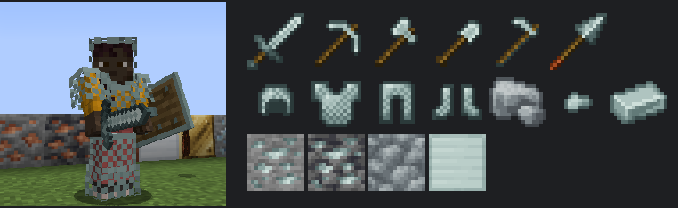
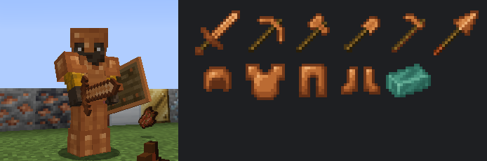
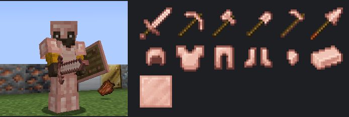
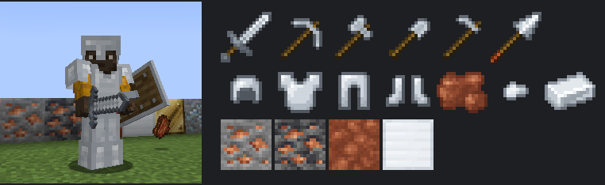
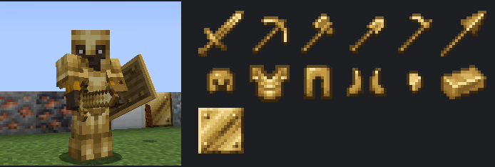
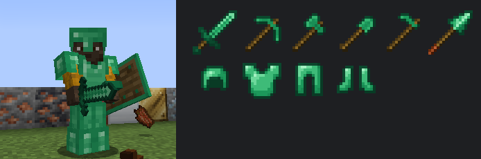
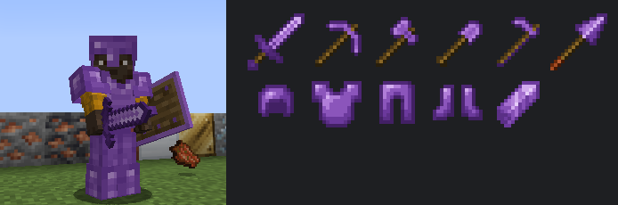
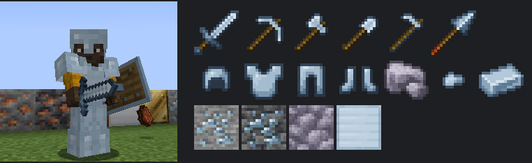
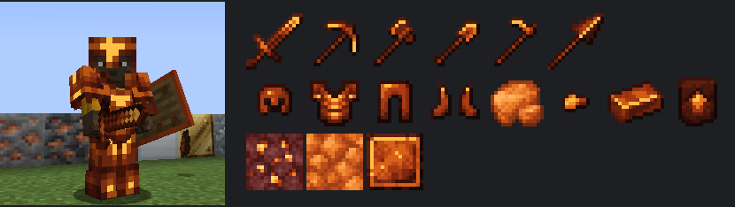
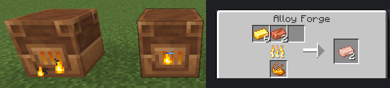

# Gear Expansion

A Minecraft mod that adds new materials, each with a full set of tools, 3D armor, and a shield. Every material plays differently: weapons with special effects, tools with useful tricks, and a set bonus for wearing all four armor pieces.

The mod aims for a Vanilla+ feel: new content that fits naturally alongside vanilla progression, with strong effects kept in check by meters, cooldowns, and costs. Nearly every number can be changed in the settings.

**Version 1.0.1** for **Minecraft 26.3**, on **Fabric** and **NeoForge**.

## Contents

- [Installation](#installation)
- [Every material at a glance](#every-material-at-a-glance)
- [The materials](#the-materials)
- [Alloy Forge](#alloy-forge)
- [Set abilities and the HUD](#set-abilities-and-the-hud)
- [Settings](#settings)
- [Other features](#other-features)
- [Building from source](#building-from-source)
- [License](#license)

## Installation

Install the mod loader for Minecraft 26.3, then put Gear Expansion and its required libraries in your `mods` folder.

### Fabric

| Download | Version | Required? |
|---|---|---|
| [Fabric Loader](https://fabricmc.net/use/installer/) | 0.19.5 or newer | Required |
| [Fabric API](https://modrinth.com/mod/fabric-api) | 0.161.0+26.3 or newer | Required |
| [Architectury API](https://modrinth.com/mod/architectury-api) | 22.0.3 or newer | Required |
| [GeckoLib](https://modrinth.com/mod/geckolib) | 5.5.7 or newer | Required |
| [YetAnotherConfigLib (YACL)](https://modrinth.com/mod/yacl) | 3.9.7+26.3 or newer | Optional: adds the in-game settings screen |
| [Mod Menu](https://modrinth.com/mod/modmenu) | 21.0.0 or newer | Optional: opens the settings screen from the mods list |
| [JEI](https://modrinth.com/mod/jei) | 31.8 or newer | Optional: shows Alloy Forge recipes |
| [REI](https://modrinth.com/mod/rei) | 26.3.823 or newer | Optional: shows Alloy Forge recipes |
| [Jade](https://modrinth.com/mod/jade) | 26.3.3 or newer | Optional: shows what an Alloy Forge is doing when you look at it |

### NeoForge

| Download | Version | Required? |
|---|---|---|
| [NeoForge](https://neoforged.net/) | 26.3.0.37-beta or newer | Required |
| [Architectury API](https://modrinth.com/mod/architectury-api) | 22.0.3 or newer | Required |
| [GeckoLib](https://modrinth.com/mod/geckolib) | 5.5.7 or newer | Required |
| [YetAnotherConfigLib (YACL)](https://modrinth.com/mod/yacl) | 3.9.7+26.3 or newer | Optional: adds the in-game settings screen |
| [JEI](https://modrinth.com/mod/jei) | 31.8 or newer | Optional: shows Alloy Forge recipes |
| [REI](https://modrinth.com/mod/rei) | 26.3.823 or newer | Optional: shows Alloy Forge recipes |
| [Jade](https://modrinth.com/mod/jade) | 26.3.1 or newer | Optional: shows what an Alloy Forge is doing when you look at it |

Notes on the optional mods:

- REI needs to be installed on the server as well for the recipes to show in multiplayer. JEI only needs to be on your game.
- REI 26.3.823 on NeoForge can crash shortly after joining a world, inside REI itself. JEI works on both loaders.
- Jade 26.3.4 crashes on startup by itself, on both loaders. Until it is fixed, use Jade 26.3.3 on Fabric or 26.3.1 on NeoForge.

Download the Gear Expansion file for your loader from the [Releases](../../releases) page: `gearexpansion-fabric-1.0.1.jar` or `gearexpansion-neoforge-1.0.1.jar`. Make sure every library is the Minecraft 26.3 version for your loader.

## Every material at a glance

From weakest to strongest. Tier is what the pickaxe can mine, using vanilla's tiers. Sword damage includes the base hand damage, like the vanilla tooltip (iron sword: 6, diamond: 7, netherite: 8).

| Material | Tier | Durability | Sword damage | Armor (full set) | Get it from | Set bonus |
|---|---|---|---|---|---|---|
| Zinc | Copper | 260 | 5 | 11 | Common ore | Galvanized |
| Verdigris | Copper | 240 | 5 | 12 (up to 16 oxidized) | Verdigris Plates | Conductive |
| Rose Gold | Copper | 180 | 4.5 | 11 | Alloy Forge | Lucky Charm |
| Aluminum | Iron | 180 | 5.5 | 12 | Bauxite ore | Featherweight |
| Brass | Iron | 300 | 6 | 15 | Alloy Forge | Clockwork |
| Silver | Iron | 280 | 6 | 15 | Ore | Blessed |
| Emerald | Iron | 500 | 6 | 15 | Emeralds | Merchant's Favor |
| Amethyst | Iron | 220 | 6 | 15 | Resonant Crystals | Shatterguard |
| Titanium | Diamond | 3000 | 7 | 20 | Rare deep ore | Unbreakable Will |
| Infernium | Netherite | 2200 | 8 | 20 | Nether ore and a template | Heat Core |

Every material has a **sword, pickaxe, axe, shovel, hoe, spear, helmet, chestplate, leggings, boots, and shield**.

## The materials

### Crafting the gear

Tools and armor use the same shapes as vanilla, with the material in place of iron (sticks for handles). The **shield** is a vanilla shield with four of the material around it:

```
 X
XSX      X = the material, S = a vanilla shield
 X
```

Infernium is the exception: it's an upgrade at a smithing table, like netherite (see below).

### Zinc



A common early metal, a step above copper.

- **Getting it:** Zinc Ore is common between Y 0 and Y 64, in stone and deepslate. Mine it with a stone pickaxe or better, then smelt or blast the raw zinc. Raw zinc, nuggets, and blocks work like iron's.
- **Corrosion-proof:** all zinc gear (tools, armor, and shield) loses no durability while you're in water.
- **Set bonus, Galvanized:** Poison, Hunger, and Nausea last 50% shorter.
- **Notes:** copper-tier tools can mine iron ore but not diamond or gold ore. Zinc is also an ingredient in Brass.

### Verdigris



Copper gear that oxidizes as you use it, like copper blocks.

- **Getting it:** craft **Verdigris Plates** from 2 copper ingots, 1 honeycomb, and 1 green dye (makes 2). The gear is made from plates.
- **Oxidation:** while held or worn, the gear slowly ages through four stages: **Fresh, Exposed, Weathered, Oxidized** (about 20 minutes of use per stage). Its color changes from shiny copper to teal patina, and so do its stats:
  - Tools mine and attack slower as they oxidize (oxidized: 70% mining speed, -0.3 attack speed).
  - Armor gets tougher (weathered and oxidized: +1 armor per piece, and up to +1 toughness).
  - Fully oxidized gear has a 30% chance to ignore each point of wear.
- **Waxing and scraping:** right-click **honeycomb** onto the item in your inventory to wax it, which stops it changing. Right-click an **axe** onto it to scrape off the wax, or, if it isn't waxed, to turn it back one stage.
- **Set bonus, Conductive:** natural lightning within 16 blocks strikes you instead, like a lightning rod, but it doesn't hurt you. A strike gives Speed and Strength for 10 seconds (once every 2 minutes).

### Rose Gold



An elegant alloy of gold and copper, built for enchanting.

- **Getting it:** in the **Alloy Forge**, 3 gold ingots and 1 copper ingot make 2 Rose Gold Ingots.
- **Gold's strengths, fixed:** fast mining (faster than iron) and very high enchantability (22 for tools, 25 for armor), with far more durability than gold. Copper tier.
- **Piglin-friendly:** piglins treat rose gold armor like gold armor and stay neutral.
- **Set bonus, Lucky Charm:** 25% more experience from experience orbs, and enchanting tables give better offers, as if 3 more bookshelves surrounded them.

### Aluminum



A light, fast metal for exploring.

- **Getting it:** smelt **Raw Bauxite** from **Bauxite Ore**, a reddish ore found between Y 32 and Y 96 everywhere, and in much richer deposits near the surface of **badlands** and **savannas** (Y 48 to 128). Mine it with a stone pickaxe or better.
- **Fast weapons and tools:** iron tier, very fast mining, and +0.3 attack speed on every tool, but low durability.
- **Light armor:** each piece adds 3% movement speed (12% for the full set), with a little less protection than iron.
- **Lightweight shield:** no slowdown while blocking (you still can't sprint).
- **Set bonus, Featherweight:** 50% less fall damage, 5% stronger jumps, and 33% faster movement in water (like Depth Strider I).

### Brass



A steampunk alloy of copper and zinc.

- **Getting it:** in the **Alloy Forge**, 3 copper ingots and 1 zinc ingot make 4 Brass Ingots.
- **Momentum:** each hit in a quick combo with a brass weapon attacks faster, up to 3 stacks. The combo ends 3 seconds after the last hit.
- **Set bonus, Clockwork:** walking, hitting, and blocking wind up a **spring** (shown above the hotbar). About 30 seconds of walking winds it fully; hits and blocks wind it faster. A fully wound spring gives Haste.
- **Ability, Spring Release (R):** with a fully wound spring, dash forward and hit every mob in front of you for 6 damage, knocking them back. This lets the spring go.

### Silver

A precious metal for fighting the undead.

- **Getting it:** Silver Ore is found between Y -16 and Y 48, in stone and deepslate. Mine it with an iron pickaxe or better, then smelt or blast the raw silver.
- **Hallowed:** silver swords, spears, and axes deal 4 extra damage to undead (zombies, skeletons, phantoms, the wither, and so on). It stacks with Smite.
- **Warding:** each armor piece takes 6% less damage from undead, including arrows from skeletons (24% for the full set).
- **Shield:** blocking an undead mob knocks it back hard.
- **Set bonus, Blessed:** Wither lasts half as long, and undead within 8 blocks glow, so you can see them through walls.

### Emerald



Gear for traders and raid defenders.

- **Getting it:** made straight from **emeralds**, so it's expensive on purpose.
- **Illager's Bane:** emerald swords, spears, and axes deal 50% more damage to raiders (pillagers, vindicators, evokers, ravagers, and witches).
- **Prospector:** the emerald pickaxe has a 25% chance to drop bonus experience when it mines an ore.
- **Lucky armor:** each piece adds 1 Luck, for better fishing and loot.
- **Shield:** blocking a raider knocks it back hard.
- **Set bonus, Merchant's Favor:** you count as a Hero of the Village (level I): villagers trade at a discount and sometimes toss you gifts.

### Amethyst



Crystal gear: fragile, but highly enchantable and full of tricks.

- **Getting it:** craft a **Resonant Crystal** from 4 amethyst shards and 1 copper ingot. The gear is made from crystals.
- **Shatter:** critical hits (attacking while falling) with an amethyst sword burst crystal over nearby mobs, dealing 3 damage to each.
- **Resonance:** when the amethyst pickaxe mines an ore, it chimes louder and higher the more of that ore is nearby. It's a hot-or-cold hint, not x-ray.
- **Perfect Block:** blocking with the amethyst shield right as you raise it knocks the attacker back with a chime.
- **Chiming armor:** the armor chimes softly when you're hit.
- **Set bonus, Shatterguard:** a crystal shell completely absorbs one hit, shatters, and regrows over 45 seconds (shown above the hotbar).

### Titanium



The reliable workhorse: diamond-level gear that almost never breaks.

- **Getting it:** Titanium Ore is rare, deep underground between Y -64 and Y -16, in small, mostly buried veins. Mine it with a diamond pickaxe or better, then smelt or blast the raw titanium.
- **Tools:** diamond tier and speed, with 3000 durability (about twice diamond), but low enchantability.
- **Armor:** diamond-level protection with extra toughness (2.5 per piece) and a little knockback resistance.
- **Shield:** 1000 durability, and axes disable it for less than half the usual time.
- **Set bonus, Unbreakable Will:** everything you use loses 50% less durability. Dropping below 30% health gives Resistance I for 5 seconds (once a minute).
- **Notes:** titanium gear is the base for Infernium.

### Infernium



The endgame metal of the Nether. Its 3D armor glows.

- **Getting it:**
  1. Find **Infernium Ore** in the Nether, between Y 10 and Y 40 in netherrack. Mine it with a diamond pickaxe or better. It's hot: mining it without Fire Resistance sets you on fire for a moment.
  2. Raw Infernium can only be smelted in a **blast furnace**.
  3. Find an **Infernium Upgrade Smithing Template**: about half of Bastion treasure chests have one, and other Bastion chests (10%) and Nether Fortress chests (8%) sometimes do. Copy a template with 7 titanium ingots, 1 netherrack, and the template, which makes 2.
  4. At a smithing table, combine the template, a piece of **titanium gear**, and an **Infernium Ingot**.
- **Fireproof:** infernium items don't burn in fire or lava.
- **Searing weapons:** swords, spears, and axes set targets on fire, and deal 3 extra damage to burning targets.
- **Smelting pickaxe:** the infernium pickaxe smelts what it mines (iron ore drops iron ingots, and so on).
- **Fire Ward:** each armor piece blocks 15% of fire damage (60% for the full set).
- **Shield:** blocking a melee attack sets the attacker on fire.
- **Set bonus, Heat Core:** walk and swim in lava unharmed for up to 10 seconds, shown by the heat gauge above the hotbar. The gauge fills in lava and cools outside it. Fire doesn't burn you while the gauge has room, and melee attackers catch fire.
- **Ability, Eruption (R):** a ring of fire sets nearby mobs alight and hurts them. The more heat you've stored, the bigger and hotter it is, and it uses up the heat. 30 second cooldown.

## Alloy Forge



A workstation for making alloys.

- **Crafting:** a blast furnace in the middle, a copper block above it, and bricks around the rest:

  ```
  B C B
  B F B      B = bricks, C = block of copper, F = blast furnace
  B B B
  ```

- **Use:** put the ingredients in any of the three input slots and fuel in the bottom slot. Recipes:
  - 3 copper ingots + 1 zinc ingot = 4 Brass Ingots
  - 3 gold ingots + 1 copper ingot = 2 Rose Gold Ingots
- **Fuel:** any normal furnace fuel. **Blaze powder** and **lava buckets** make it work twice as fast.
- **Experience:** taking the results gives experience, like a furnace.
- **Automation:** hoppers on top fill the inputs, hoppers on the side add fuel, and hoppers underneath take the results.
- **Compatibility:** recipes use the common ingot tags, so copper, zinc, and gold from other mods work too.
- **Recipe viewers:** with JEI or REI installed, the Alloy Forge has its own recipe category. With Jade installed, looking at a forge shows its inputs, fuel, progress, and result.

## Set abilities and the HUD

- **Set Ability key:** **R** by default. Change it under Controls, in the Gear Expansion category. It uses the ability of the full set you're wearing: **Spring Release** (Brass) or **Eruption** (Infernium).
- **HUD meters** appear above the hotbar only when they matter: Brass's spring, Infernium's heat gauge, Amethyst's crystal shell, and the ability cooldown.
- **Tooltips** show each item's special traits, the set bonus, and how many pieces of the set you're wearing, like "Titanium Set (3/4)". The bonus is greyed out until you wear all four.

## Settings

Settings are saved in `config/gearexpansion.json5`, with an explanation above each one. You can turn each set bonus on or off and change its numbers: cooldowns, percentages, durations, ranges, and more.

With **YACL** installed, you can also change them in game:

- **Fabric:** open Mod Menu, select Gear Expansion, and click the settings button.
- **NeoForge:** open Mods from the title screen, select Gear Expansion, and click Config.

**On a server**, the server's settings are what count. When you join, your game uses the server's settings until you leave, so tooltips match what actually happens. Your own settings file isn't changed.

## Other features

- **Creative tabs:** four tabs, Blocks, Tools, Combat, and Ingredients, grouped by material.
- **Advancements:** a Gear Expansion tab with an advancement for each material, the Alloy Forge, and the Infernium upgrade.
- **Compatibility:** ores, raw materials, ingots, nuggets, and storage blocks use the common `c:` tags (for example `c:ingots/titanium`), so other mods' machines and recipes recognize them.
- **Equip sounds:** each armor set has its own sound when you put it on.
- **Armor trims** aren't supported yet; the 3D armor has its own look.

## Building from source

Requires a Java 25 JDK.

```
git clone <repository-url>
cd GearExpansion
./gradlew build
```

The built mod files are placed in `fabric/build/libs` and `neoforge/build/libs`.

To start a development copy of the game with the mod loaded:

```
./gradlew :fabric:runClient
./gradlew :neoforge:runClient
```

### Development

Generated data (models, recipes, loot tables, tags, translations, advancements, and world generation) is built from the material definitions in code. Regenerate it after changing a material:

```
./gradlew :fabric:runDatagen
```

The output goes to `common/src/main/generated` and is committed with the code.

Automated in-game checks start a test world, verify recipes, mining tiers, ore generation, the Alloy Forge, set bonuses, abilities, and tooltips, and save screenshots to `fabric/build/gametest/screenshots`:

```
./gradlew :fabric:runGameTest
```

JEI and REI are optional. Development runs (`runClient`, `runGameTest`) load JEI; pick another with `-Precipe_viewer=rei`, `jei,rei`, or `none`, for example `./gradlew :fabric:runGameTest -Precipe_viewer=rei`. Jade is always loaded in development runs.

To test on a dedicated server, run `./gradlew :fabric:runServer` or `./gradlew :neoforge:runServer`. The server uses `run/server` in that module, with its own world and settings file.

A passing run logs `All Gear Expansion checks passed`. The task can still report a failure afterwards because a development-only Architectury tool keeps the game from closing within 15 seconds; this does not affect the built mod.

Textures and 3D armor and shield models are generated by a script. It recolors vanilla textures from the Minecraft jar in the Gradle cache, so run a Gradle build once first. Add a new material's color gradients and source textures in `tools/generate_assets.py`, then run:

```
python tools/generate_assets.py
```

### Project layout

The mod uses Architectury to support both loaders from one codebase.

- `common` holds the shared code and assets. Most of the mod lives here. Each material is defined once in `ModMaterials`.
- `common/src/main/generated` holds the generated data.
- `fabric` holds the Fabric entrypoints, `fabric.mod.json`, the data generators, and the game tests.
- `neoforge` holds the NeoForge entrypoint and `neoforge.mods.toml`.
- `docs/images` holds the pictures in this README.

See [CHANGELOG.md](CHANGELOG.md) for what changed in each version, and [ideas.md](ideas.md) for plans.

## License

The code is licensed under the MIT License. See [LICENSE](LICENSE) for details.

The textures in `common/src/main/resources/assets/gearexpansion/textures` (and the pictures in `docs/images`) are based on Minecraft textures. Minecraft's textures belong to Mojang, so these files are not covered by the MIT License.
